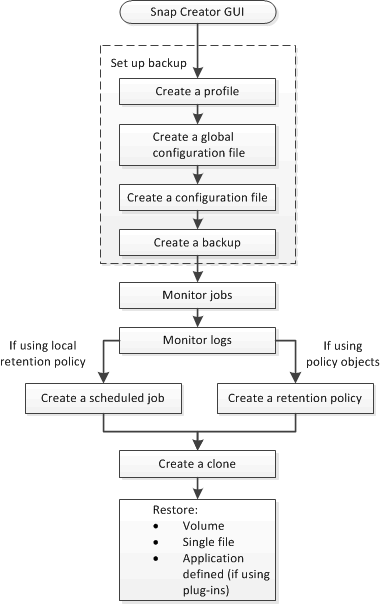

= 备份和恢复工作流
:icons: font
:imagesdir: ../media/

[role="lead"]
您可以使用 Snap Creator GUI 将此工作流作为备份和恢复过程的参考。

执行这些任务时， Snap Creator 必须正在运行， Snap Creator GUI 必须处于打开状态。如果不是，则可以在 Web 浏览器（"https://IP_address:gui_port"[] 默认情况下，端口为 8443 ），然后使用 Snap Creator GUI 凭据登录。

下图展示了使用插件时执行系统备份和恢复时的一整套任务：

NOTE: 工作流中概述的任务也可以从命令行界面（ CLI ）执行。有关 CLI 的详细信息，请参见相关参考，了解有关 CLI 命令行的信息。

* 相关信息 *

xref:reference_guidelines_for_using_the_snap_creator_command_line.adoc[使用 Snap Creator 命令行界面的准则]
