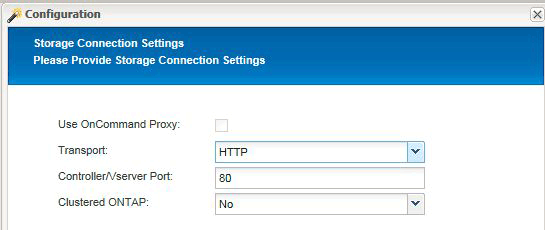
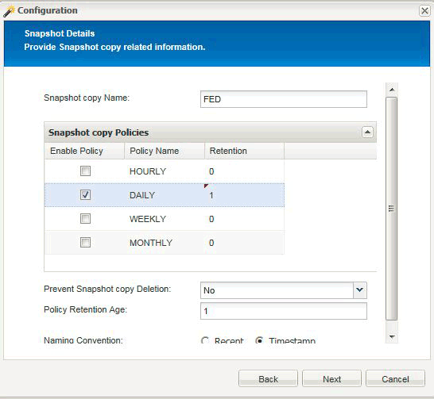

= 使用虚拟机管理程序插件时，为多级别应用程序配置 Snap Creator 将暂停操作
:icons: font
:imagesdir: ../media/

[role="lead"]
如果您使用的是虚拟机管理程序（也称为 "`虚拟化` " ）插件（ VMware （ VMware vCloud Director 和 VMware vSphere ）， KVM 和 Citrix XenServer ），并且希望执行多级别应用程序暂停和备份操作，则需要为此类型的设置配置 Snap Creator 。

通过此配置，您可以暂停虚拟机上的应用程序，暂停虚拟机，然后创建 Snapshot 副本。

在此过程中，您将通过指定包含一个或多个子配置文件的父配置文件来创建虚拟机管理程序和应用程序配置。此父配置文件包含典型的配置文件信息，例如保留策略， SVM 详细信息以及虚拟机管理程序插件的信息。每个子配置文件都包含使用特定应用程序插件执行 Snap Creator 暂停和取消静默操作所需的详细信息。

. 创建新配置文件。
. 创建新配置。
+
.. 在配置页面上，输入配置文件的名称。
+

NOTE: 默认情况下，密码加密处于启用状态，以防止密码以明文形式显示在配置文件中。

.. 在插件类型页面上，选择 * 虚拟化插件 * 。
.. 在虚拟化插件页面上，选择要配置的插件。
.. 在插件参数页面上，提供与选定插件选项关联的配置详细信息。
+
在以下示例中， VMware vSphere 是选定的虚拟化插件。显示的向导屏幕取决于您的选择。

+
... 提供相应的信息并单击 * 添加 * 。
+
image::../media/scf_config_multilvl_setup_1.gif[SCF 配置 multivl 设置 1.]

... 在 New vCenter 页面上，提供 vCenter IP 和主机名，然后单击 * 添加 * 。
... 选择适用的数据存储库和虚拟机进行备份。
+
image::../media/scf_config_multilvl_setup_2.gif[SCF 配置 multivl 设置 2.]

... 验证您输入的详细信息是否正确。
... 在代理配置页面上，提供 VMware 代理详细信息，这些详细信息是您安装了代理的系统的详细信息。
+

NOTE: 端口是代理正在侦听的端口。

+
单击 * 测试代理连接 * 以确保代理正在运行。

... 在虚拟机管理程序 + 应用程序备份页面上，选择 * 是 * ，因为需要虚拟机管理程序和应用程序一致的备份。
... 在虚拟机管理程序 + 应用程序配置页面上，为虚拟机管理程序和应用程序配置提供父配置名称。
... 在插件类型页面上，选择 * 应用程序插件 * 。
... 在应用程序插件页面上，选择要用于备份和还原的应用程序。
... 提供选定应用程序的详细信息。
... 在代理配置页面上，提供应用程序 Snap Creator Agent 详细信息，这些详细信息是您安装了该代理的应用程序或数据库主机的详细信息。
+

NOTE: 通常，主机是要备份的虚拟机，其中运行有应用程序。

+
单击 * 测试代理连接 * 以确保代理正在运行。

... 在摘要页面上，验证信息并单击 * 完成 * 。
... 在虚拟机管理程序 + 应用程序页面上，您可以选择以下选项：
+
**** 要在此配置中添加其他应用程序，请单击 * 添加 * 并在此示例中重复步骤 vii 到 xii 。
**** 要从此配置中删除应用程序，请选择该项，然后单击 * 删除 * 。
**** 要继续使用主配置向导，请单击 * 下一步 * 。
+

NOTE: 如果列出了多个应用程序，您可以通过在列表中上移或下移某个应用程序来重新排列此列表。应用程序会按顺序进行备份，因此，如果某个应用程序需要先暂停，然后再暂停列表中的另一个应用程序，则需要按正确顺序放置这些应用程序。

.. 在存储连接设置页面上，提供以下信息：
+
*** 对于 * 传输 * 选项，选择 * HTTPS * 。
*** 对于 * 控制器 /Vserver Port* 选项，保留默认设置（ 443 ）。
*** 对于 * 集群模式 ONTAP * 选项，选择 * 是 * 。

.. 在 New Controller/Vserver 页面上，提供控制器 IP 地址，用户名和密码。
.. 提供 Snapshot 副本详细信息。
+

.. 在 Snapshot 详细信息（续）页面上，不要选择 * 一致性组 * 选项。
.. 在 " 数据保护 " 页面上，请勿选择任何一个 * 数据传输 * 选项。
.. 验证摘要页面上的信息，然后单击 * 完成 * 。

* 相关信息 *

xref:task_creating_profiles.adoc[正在创建配置文件]

xref:task_creating_configuration_files_using_sc_gui.adoc[正在创建配置文件]
