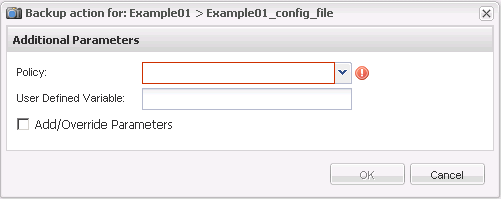

= 创建备份
:allow-uri-read: 
:icons: font
:imagesdir: ../media/

[role="lead"]
您可以使用 Snap Creator GUI 创建备份。

必须满足以下条件之一：

* 必须在配置文件中定义备份策略；或者
* 必须配置策略对象并将其分配给配置文件。
+

NOTE: 如果定义了策略对象，则会覆盖配置文件中可能包含的任何条目。

+
.. 从 Snap Creator GUI 主菜单中，选择 * 管理 * > * 配置 * 。
.. 从 * 配置 * 选项卡的 * 配置文件和配置 * 窗格中，选择配置文件。
.. 选择 * 操作 * > * 备份 * 。
+
image::../media/backup_select.gif[备份选择]

.. 在其他参数对话框中，选择策略，然后单击 * 确定 * 以启动备份。
+

NOTE: 如果没有为配置分配用户创建的策略，则可以在 * 策略 * 下拉列表中选择每小时，每天，每周和每月。如果为配置分配了一个或多个用户创建的策略，则这些策略将显示在 * 策略 * 下拉列表中。

+

.. 验证有关备份作业的信息是否显示在 * 控制台 * 窗格中。
+
image::../media/console_area_backup.gif[控制台区域备份]

+
在此示例中，输出指示 Snap Creator 操作已成功完成。

+

NOTE: * 控制台 * 窗格仅显示最相关的信息；这是详细模式。要查看有关刚刚运行的作业的详细信息，请选择页面顶部的 * 报告 * > * 日志 * 。在日志视图中，可以选择配置文件，配置文件，日志类型和特定日志。

