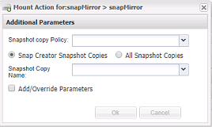

= 从现有备份创建克隆
:allow-uri-read: 
:icons: font
:imagesdir: ../media/

[role="lead"]
您可以将现有备份中的卷或 LUN 克隆为源。

* Snap Creator 服务器必须与存储系统通信。
* 您必须以适当的权限登录到 Snap Creator 才能执行克隆操作。

此克隆操作包括挂载现有 Snapshot 副本，然后克隆现有备份。

. 从 Snap Creator GUI 主菜单中，选择 * 管理 * > * 配置 * 。
. 从 * 配置 * 选项卡的 * 配置文件和配置 * 窗格中，选择一个配置文件。
. 选择 * 操作 * > * 挂载 * 。
. 在 Additional Parameters 对话框中，选择包含要挂载的备份的控制器，卷和策略，然后选择要挂载（克隆）的 Snapshot 副本，然后单击 * 确定 * 以启动克隆过程。
+

+

NOTE: 记录选定的 Snapshot 副本名称。卸载备份时，必须选择相同的 Snapshot 副本名称。

. 在 * 控制台 * 窗格中，验证克隆过程是否成功。

