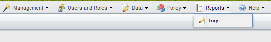
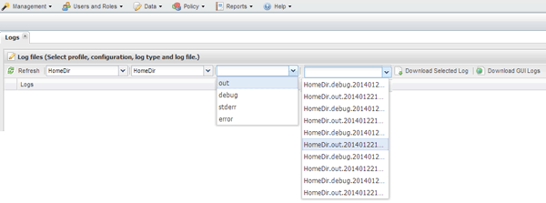

= 监控日志
:icons: font
:imagesdir: ../media/

[role="lead"]
您可以使用 Snap Creator GUI 查看每个配置文件和配置的日志。

您可以查看 " 出 " ， " 调试 " ， " 错误 " 和 " stderr " 日志，以协助排除操作故障。有关这些故障排除日志的详细信息，请参见相关参考。

. 从 Snap Creator GUI 主菜单中，选择 * 报告 * > * 日志 * ：
+

. 根据需要，按配置文件，配置文件，日志类型或特定日志选择日志：
+

+
也可以单击 * 下载选定日志 * 来下载选定日志。下载的日志文件存储在浏览器为下载指定的目录（或文件夹）中。

+

NOTE: 输出，调试， stderr 和代理日志会按照配置文件中 log_nUM 值的定义保留，但始终会附加错误日志。

* 相关信息 *

xref:reference_logs.adoc[错误消息和故障排除日志的类型]
