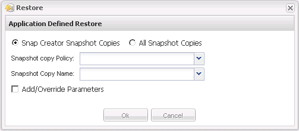

= 执行应用程序定义的还原操作
:allow-uri-read: 
:icons: font
:imagesdir: ../media/

[role="lead"]
如果您使用的是 VMware ， KVM 和 Xen 插件，则可以使用 Snap Creator GUI 执行应用程序定义的还原操作。

在某些 VMware 环境中，还原操作可能需要很长时间。在这种情况下，您可以使用 Snap Creator 命令行界面或设置两个代理：一个用于备份，另一个用于还原。

NOTE: 只有 Snap Creator Agent 才支持使用 GUI 执行 VMware 还原操作。

. 从 Snap Creator GUI 主菜单中，选择 * 管理 * > * 配置 * 。
. 从 * 配置 * 选项卡的配置文件和配置窗格中，选择配置文件。
. 选择 * 操作 * > * 还原 * 。
+
右窗格中将显示应用程序定义的还原对话框。

. 输入还原详细信息并单击 * 确定 * ：
+

