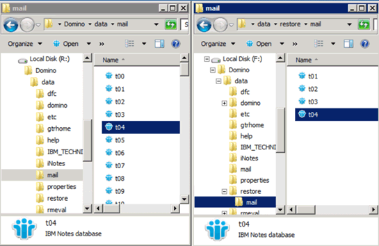

= 将文件复制到数据还原目录
:icons: font
:imagesdir: ../media/

[role="lead"]
挂载要还原的文件的 Snapshot 副本后，您可以将该文件复制到备份和还原配置文件中指定的数据还原目录。

. 从挂载的 Snapshot 副本复制要还原的文件。
. 将文件粘贴到备份和还原配置文件中指定的数据还原目录中。
+
以下示例显示了如何将数据库文件 t04.nssf 从 R ：驱动器上挂载的 Snapshot 副本复制到配置文件中指定的数据还原目录。

+

