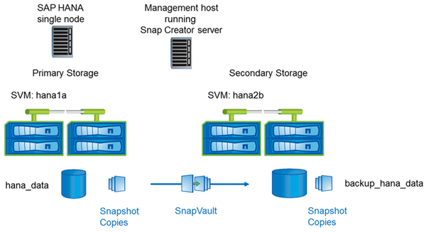

= 与集群模式 Data ONTAP 结合使用的设置
:icons: font
:imagesdir: ../media/

下图显示了集群模式 Data ONTAP 所使用的设置。此设置基于单节点 SAP HANA 配置，其中包含 Storage Virtual Machine （ SVM ）和卷名称，如下图所示。

在集群模式 Data ONTAP 和 7- 模式 Data ONTAP 中，准备，启动，恢复和还原 SnapVault 操作的方式有所不同。本指南的相应章节将介绍这些差异。
