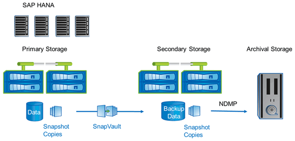

= NetApp 解决方案
:icons: font
:imagesdir: ../media/

[role="lead"]
使用 NetApp Snapshot ® 技术，只需几分钟即可创建数据库备份。创建 Snapshot 副本所需的时间与数据库大小无关，因为 Snapshot 副本不会移动任何数据块。

使用 Snapshot 技术也不会影响生产 SAP 系统的性能。因此，可以计划创建 Snapshot 副本，而无需考虑活动高峰期。SAP 和 NetApp 客户通常会在一天内计划多个联机 Snapshot 备份。例如，备份可能每四小时进行一次。这些 Snapshot 备份通常在主存储系统上保留三到五天。

Snapshot 副本还为还原和恢复操作提供了主要优势。通过 NetApp SnapRestore ® 功能，可以将整个数据库或数据库的部分内容还原到创建任何可用 Snapshot 副本时的时间点。此还原过程只需几分钟即可完成，与数据库大小无关。恢复过程所需的时间也显著减少，因为一天中创建了多个 Snapshot 副本，需要应用的日志更少。

Snapshot 备份与活动的联机数据存储在同一磁盘系统上。因此， NetApp 建议使用 Snapshot 备份作为补充，而不是替代备份到磁盘或磁带等二级位置。尽管仍需要备份到二级位置，但还原和恢复只需要这些备份的极小可能性。大多数还原和恢复操作都通过在主存储系统上使用 SnapRestore 来处理。只有当存放 Snapshot 副本的主存储系统损坏或需要还原不再可从 Snapshot 副本使用的备份时，才需要从二级位置进行还原。例如，您可能需要从两周前还原备份。

备份到二级位置始终基于在主存储上创建的 Snapshot 副本。因此，可以直接从主存储系统读取数据，而不会在 SAP 数据库服务器上生成负载。主存储直接与二级存储通信，并使用 SnapVault ® 磁盘到磁盘备份将备份数据发送到目标。与传统备份相比， NetApp SnapVault 功能具有显著优势。在必须将所有数据从源传输到目标的初始数据传输之后，所有后续备份仅会将更改过的块复制到二级存储。这样可以显著降低主存储系统上的负载以及完整备份所需的时间。由于 SnapVault 仅在目标上存储更改过的块，因此完整的数据库备份所需的磁盘空间更少。

可能仍需要将数据备份到磁带作为长期备份。例如，这可能是每周备份，保留一年。在这种情况下，磁带基础架构可以直接连接到二级存储，数据可以使用网络数据管理协议（ Network Data Management Protocol ， NDMP ）写入磁带。

