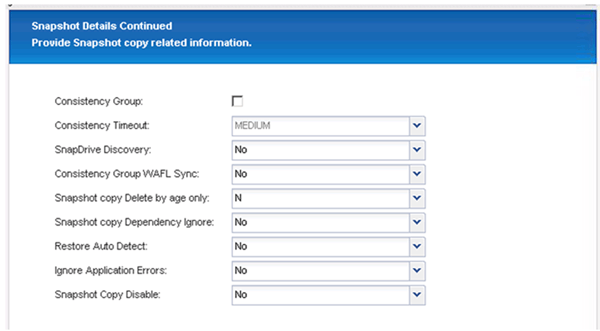
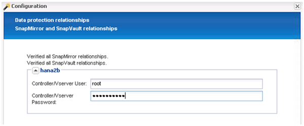

= 配置 Snap Creator Framework 和 SAP HANA 数据库备份
:allow-uri-read: 
:icons: font
:imagesdir: ../media/

[role="lead"]
您必须配置 Snap Creator Framework 和 SAP HANA 数据库备份。

. 连接到 Snap Creator 图形用户界面（ GUI ）： https://host:8443/ui/[]。
. 使用安装期间配置的用户名和密码登录。单击 * 登录 * 。
+
image::../media/snap_creator_gui.gif[显示了 Snap Creator GUI 登录]

. 输入配置文件名称并单击 * 确定 * 。
+
image::../media/sap_hana_user_profile.gif[SAP HANA 用户配置文件]

+
例如， "`ANA` " 是数据库的 SID 。

. 输入配置名称，然后单击 * 下一步 * 。
+
image::../media/sap_hana_gui_for_configuration_name.gif[显示在字段中输入的配置名称]

. 选择 * 应用程序插件 * 作为插件类型，然后单击 * 下一步 * 。
+
image::../media/sap_hana_config_plugin_type.gif[显示了所选应用程序插件]

. 选择 * SAP HANA * 作为应用程序插件，然后单击 * 下一步 * 。
+
image::../media/sap_hana_select_application_plug_in.gif[SAP HANA Select 应用程序插件]

. 输入以下配置详细信息：
+
.. 从下拉菜单中选择 * 是 * 以对多租户数据库使用配置。对于单个容器数据库，请选择 * 否 * 。
.. 如果多租户数据库容器设置为 * 否 * ，则必须提供数据库 SID 。
.. 如果多租户数据库容器设置为 * 是 * ，则必须为每个 SAP HANA 节点添加 hdbuserstore 密钥。
.. 添加租户数据库的名称。
.. 添加必须执行 hdbsql. 语句的 HANA 节点。
.. 输入 HANA 节点实例编号。
.. 提供 hdbsql. 可执行文件的路径。
.. 添加 O深圳 发展银行用户。
.. 从下拉列表中选择 * 是 * 以启用日志清理。
+
注意

+
*** 只有当参数 `hana multitenant_database` 的值设置为 `N` 时，参数 `hana SID` 才可用
*** 对于资源 `S类型为 " 单租户` " 的多租户数据库容器（ MDC ）， SAP HANA Snapshot 副本可使用基于用户存储密钥的身份验证。如果 `hana multitenant_database` 参数设置为 `Y` ，则必须将 `hana _USERSTORE_keys` 参数设置为相应的值。
*** 与非多租户数据库容器类似，支持基于文件的备份和完整性检查功能

.. 单击 * 下一步 * 。

+
image::../media/file_based_backup_configuration.gif[基于文件的备份配置]

. 启用基于文件的备份操作：
+
.. 设置文件备份位置。
.. 指定文件备份前缀。
.. 选中 * 启用文件备份 * 复选框。
.. 单击 * 下一步 * 。
+
image::../media/enable_file_based_backup.gif[启用基于文件的备份]

. 启用数据库完整性检查操作：
+
.. 设置临时文件备份位置。
.. 选中 * 启用数据库完整性检查 * 复选框。
.. 单击 * 下一步 * 。

+
image::../media/integrity_checks.gif[数据库完整性检查]

. 输入代理配置参数的详细信息，然后单击 * 下一步 * 。
+
image::../media/sap_hana_agent_configuration_parameter.gif[此图通过周围的文本进行了说明。]

. 输入存储连接设置，然后单击 * 下一步 * 。
+
image::../media/sap_hana_storage_connect_gui.gif[此图通过周围的文本进行了说明。]

. 输入存储登录凭据，然后单击 * 下一步 * 。
+
image::../media/sap_hana_storage_login_credentials_gui.gif[此图通过周围的文本进行了说明。]

. 选择存储在此存储控制器上的数据卷，然后单击 * 保存 * 。
+
image::../media/sap_hana_select_data_volumes.gif[此图通过周围的文本进行了说明。]

. 单击 * 添加 * 以添加另一个存储控制器。
+
image::../media/sap_hana_add_controller.gif[此图通过周围的文本进行了说明。]

. 输入存储登录凭据，然后单击 * 下一步 * 。
+
image::../media/sap_hana_storage_login_credentials2.gif[此图通过周围的文本进行了说明。]

. 选择存储在您创建的第二个存储控制器上的数据卷，然后单击 * 保存 * 。
+
image::../media/sap_hana_controller_volumes_selection.gif[此图通过周围的文本进行了说明。]

. 控制器 /Vserver 凭据窗口将显示您添加的存储控制器和卷。单击 * 下一步 * 。
+
image::../media/sap_hana_view_storage_credentials.gif[此图通过周围的文本进行了说明。]

. 输入 Snapshot 策略和保留配置。
+
例如，保留三个每日 Snapshot 副本和八个每小时 Snapshot 副本，可以根据客户要求进行不同的配置。

+

NOTE: 选择 * 时间戳 * 作为命名约定。SAP HANA 插件不支持使用命名约定 * 最近 * ，因为 Snapshot 副本的时间戳也用于 SAP HANA 备份目录条目。

+
image::../media/sap_hana_snapshot_details_gui.gif[此图通过周围的文本进行了说明。]

. 无需更改。单击 * 下一步 * 。
+

. 选择 * SnapVault * ，然后配置 SnapVault 保留策略和 SnapVault 等待时间。
+
image::../media/sap_hana_data_protection_gui.gif[此图通过周围的文本进行了说明。]

. 单击 * 添加 * 。
+
image::../media/sap_hana_data_protection_volumes.gif[此图通过周围的文本进行了说明。]

. 从列表中选择一个源存储控制器，然后单击 * 下一步 * 。
+
image::../media/sap_hana_dp_volumes_gui_select_storage_controller.gif[此图通过周围的文本进行了说明。]

. 选择源存储控制器上存储的所有卷，然后单击 * 保存 * 。
+
image::../media/sap_hana_volume_selection_gui.gif[此图通过周围的文本进行了说明。]

. 单击 * 添加 * ，从列表中选择第二个源存储控制器，然后单击 * 下一步 * 。
+
image::../media/sap_hana_configuration_data_protection_volumes_select_controller.gif[此图通过周围的文本进行了说明。]

. 选择存储在第二个源存储控制器上的所有卷，然后单击 * 保存 * 。
+
image::../media/sap_hana_data_protection_volume_selection.gif[此图通过周围的文本进行了说明。]

. " 数据保护卷 " 窗口显示在您创建的配置中应受保护的所有卷。单击 * 下一步 * 。
+
image::../media/sap_hana_data_protection_volumes_gui.gif[此图通过周围的文本进行了说明。]

. 输入目标存储控制器的凭据，然后单击 * 下一步 * 。在此示例中，使用 "`root` " 用户凭据来访问存储系统。通常，在存储系统上配置一个专用备份用户，然后将其与 Snap Creator 结合使用。
+

. 单击 * 下一步 * 。
+
image::../media/sap_hana_dfm_oncommand_settings_gui.gif[DFM/OnCommand 设置 GUI 。此图通过周围的文本进行了说明。]

. 单击 * 完成 * 以完成配置。
+
image::../media/sap_hana_data_protection_configuration_summary.gif[此图通过周围的文本进行了说明。]

. 单击 * SnapVault settings* 选项卡。
. 从 * SnapVault 还原等待 * 选项的下拉列表中选择 * 是 * ，然后单击 * 保存 * 。
+
image::../media/sap_hana_snapvault_settings_gui.gif[此图通过周围的文本进行了说明。]

+
建议您使用专用网络传输复制流量。如果决定这样做，则应将此接口作为二级接口包含在 Snap Creator 配置文件中。

+
您还可以配置专用管理接口，以便 Snap Creator 可以使用未绑定到存储控制器主机名的网络接口来访问源或目标存储系统。

+
[listing]
----
mgmtsrv01:/opt/NetApp/Snap_Creator_Framework_411/scServer4.1.1c/engine/configs/HANA_profile_ANA
# vi ANA_database_backup.conf

#####################################################################
########################
#     Connection Options                                            #
#####################################################################
########################
PORT=443
SECONDARY_INTERFACES=hana1a:hana1a-rep/hana2b;hana1b:hana1b-rep/hana2b
MANAGEMENT_INTERFACES=hana2b:hana2b-mgmt
----

