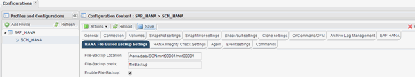

= 修改基于文件的备份的配置
:icons: font
:imagesdir: ../media/

[role="lead"]
您可以修改为基于文件的备份配置的参数。后续计划的或按需的基于文件的备份操作会反映更新后的信息。

. 单击 SAP HANA 配置文件。
. 选择要修改的配置，然后单击 * 基于 HANA 文件的备份设置 * 。
+

. 编辑此信息，然后单击 * 保存 * 。

