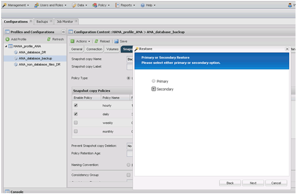
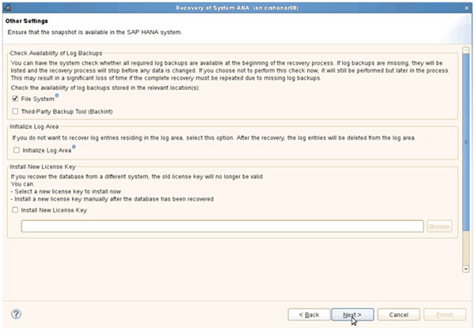

= 从二级存储还原和恢复数据库
:icons: font
:imagesdir: ../media/

[role="lead"]
您可以从二级存储还原和恢复数据库。

. 在 SAP HANA Studio 中，为 SAP HANA 系统选择 * 恢复 * 。
+
image::../media/sap_hana_recovery_secondary_storage_gui.gif[此图通过周围的文本进行了说明。]

+
SAP HANA 系统将关闭。

. 选择恢复类型并单击 * 下一步 * 。
+
image::../media/sap_hana_secondary_specify_recovery_type.gif[此图通过周围的文本进行了说明。]

. 提供日志备份位置，然后单击 * 下一步 * 。
+
image::../media/sap_hana_secondary_log_backup_locations.gif[此图通过周围的文本进行了说明。]

+
此时将根据备份目录的内容显示可用备份列表。

. 选择所需的备份并记下外部备份 ID 。
+
image::../media/sap_hana_recover_secondary_select_backup.gif[此图通过周围的文本进行了说明。]

. 转到 Snap Creator GUI 。
. 选择 SAP HANA 系统，然后单击 * 操作 * > * 还原 * 。
+
image::../media/sap_hana_secondary_select_backup_restore.gif[此图通过周围的文本进行了说明。]

+
此时将显示欢迎屏幕。

+
image::../media/sap_hana_secondary_welcome_screen.gif[此图通过周围的文本进行了说明。]

. 单击 * 下一步 * 。
. 选择 * 二级 * 并单击 * 下一步 * 。
+

. 输入所需信息。Snapshot 名称与在 SAP HANA Studio 中选择的备份 ID 关联。
+
image::../media/sap_hana_select_backup_restore04_secondary_scf_gui.gif[此图通过周围的文本进行了说明。]

. 选择 * 完成 * 。
+
image::../media/sap_hana_secondary_restore_summary.gif[此图通过周围的文本进行了说明。]

. 单击 * 是 * 添加更多项以进行还原。
+
image::../media/sap_hana_secondary_snapshot_settings_warning.gif[此图通过周围的文本进行了说明。]

. 为需要还原的所有卷提供所需信息。在设置 data_00001 中，需要为还原过程选择 data_00002 和 data_00003 。
+
image::../media/sap_hana_secondary_snapvault_restore.gif[此图通过周围的文本进行了说明。]

. 选择所有卷后，选择 * 确定 * 以启动还原过程。
+
请等待还原过程完成。

. 在每个数据库节点上，重新挂载所有数据卷以清理 " `SNFS 句柄 " 。`
+
在此示例中，所有三个卷都需要在每个数据库节点上重新挂载。

+
[listing]
----
mount -o remount /hana/data/ANA/mnt00001
mount -o remount /hana/data/ANA/mnt00002
mount -o remount /hana/data/ANA/mnt00003
----
. 转到 SAP HANA Studio 并单击 * 刷新 * 以更新备份列表。
+
image::../media/sap_hana_secondary_select_backup_to_recover.gif[此图通过周围的文本进行了说明。]

. 使用 Snap Creator 还原的备份在备份列表中显示绿色图标。选择备份并单击 * 下一步 * 。
. 根据需要选择其他设置，然后单击 * 下一步 * 。
+

. 单击 * 完成 * 。
+
image::../media/sap_hana_secondary_review_recovery_settings.gif[此图通过周围的文本进行了说明。]

+
恢复过程开始。

+
image::../media/sap_hana_secondary_recovery_progress_information.gif[此图通过周围的文本进行了说明。]

. 恢复过程完成后，根据需要恢复 SnapVault 关系。
+
image::../media/sap_hana_secondary_recovery_execution_summary.gif[此图通过周围的文本进行了说明。]

