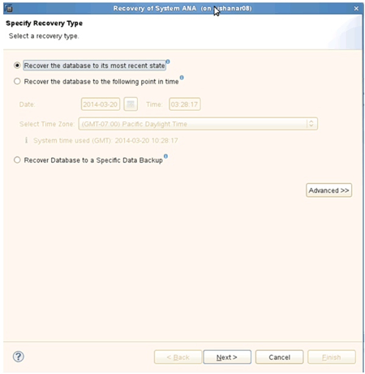
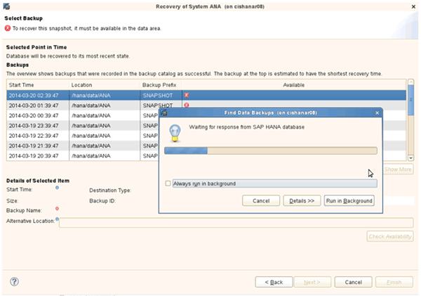

= 从主存储还原和恢复数据库
:icons: font
:imagesdir: ../media/

[role="lead"]
您可以从主存储还原和恢复数据库。

NOTE: 您不能从 Snap Creator 还原基于文件的备份副本。

. 在 SAP HANA Studio 中，为 SAP HANA 系统选择 * 恢复 * 。
+
image::../media/sap_hana_recover_primary_gui.gif[此图通过周围的文本进行了说明。]

+
SAP HANA 系统关闭。

. 选择恢复类型并单击 * 下一步 * 。
+

. 提供日志备份位置，然后单击 * 下一步 * 。
+
image::../media/sap_hana_recover_primary_log_backup_location.gif[此图通过周围的文本进行了说明。]

+
您看到的可用备份列表取决于备份目录的内容。

. 选择所需的备份并记录外部备份 ID 。
+
image::../media/sap_hana_recovery_primary_select_backup.gif[此图通过周围的文本进行了说明。]

. 停用 SnapVault 关系。
+

NOTE: 只有集群模式 Data ONTAP 才需要执行此步骤。

+
如果需要还原的 Snapshot 副本早于当前用作 SnapVault 基本 Snapshot 副本的 Snapshot 副本，则必须先在集群模式 Data ONTAP 中停用 SnapVault 关系。为此，请在备份集群控制台上执行以下命令：

+
[listing]
----
hana::> snapmirror quiesce -destination-path hana2b:backup_hana_data
Operation succeeded: snapmirror quiesce for destination hana2b:backup_hana_data.

hana::> snapmirror delete -destination-path hana2b:backup_hana_data
Operation succeeded: snapmirror delete the relationship with destination hana2b:backup_hana_data.

hana::> snapmirror release -destination-path hana2b:backup_hana_data
[Job 6551] Job succeeded: SnapMirror Release Succeeded
----
. 在 Snap Creator GUI 中，选择 SAP HANA 系统，然后选择 * 操作 * > * 还原 * 。
+
image::../media/sap_hana_select_restore_backup.gif[此图通过周围的文本进行了说明。]

+
此时将显示 Welcome to the Snap Creator Framework Restore Wizard 屏幕。

. 单击 * 下一步 * 。
+
image::../media/sap_hana_primary_restore_welcome_screen.gif[此图通过周围的文本进行了说明。]

. 选择 * 主 * 并单击 * 下一步 * 。
+
image::../media/sap_hana_primary_restore_primary_select.gif[此图通过周围的文本进行了说明。]

. 选择从主存储还原。
. 选择存储控制器，卷名称和 Snapshot 名称。
+
Snapshot 名称与在 SAP HANA Studio 中选择的备份 ID 关联。

+
image::../media/sap_hana_select_backup_restore_scf_gui.gif[此图通过周围的文本进行了说明。]

. 单击 * 完成 * 。
+
image::../media/sap_hana_primary_restore_summary.gif[此图通过周围的文本进行了说明。]

. 单击 * 是 * 添加更多还原项。
+
image::../media/sap_hana_add_more_restore_items.gif[此图通过周围的文本进行了说明。]

. 选择存储控制器，其他卷名称和 Snapshot 名称。
+
Snapshot 名称与在 SAP HANA Studio 中选择的备份 ID 关联。

+
image::../media/sap_hana_primary_select_restore_details.gif[此图通过周围的文本进行了说明。]

. 重复步骤 10 到 13 ，直到添加了所有必需的卷；在本示例中，需要为还原过程选择 data_00001 ， data_00002 和 data_00003 。
. 选择所有卷后，单击 * 确定 * 以启动还原过程。
+
image::../media/sap_hana_select_volume_restore.gif[此图通过周围的文本进行了说明。]

+
此时将启动还原过程。

+
image::../media/sap_hana_primary_general_restore_process_in_progress.gif[此图通过周围的文本进行了说明。]

+
请等待还原过程完成。

. 在每个数据库节点上，重新挂载所有数据卷以清除陈旧的 NFS 句柄。
+
在此示例中，所有三个卷都需要在每个数据库节点上重新挂载。

+
[listing]
----
mount -o remount /hana/data/ANA/mnt00001
mount -o remount /hana/data/ANA/mnt00002
mount -o remount /hana/data/ANA/mnt00003
----
. 转到 SAP HANA Studio 并单击 * 刷新 * 以更新可用备份列表。
+

+
使用 Snap Creator 还原的备份在备份列表中显示绿色图标。

. 选择备份并单击 * 下一步 * 。
+
image::../media/sap_hana_select_backup_to_recover_database.gif[此图通过周围的文本进行了说明。]

. 根据需要选择其他设置，然后单击 * 下一步 * 。
+
image::../media/sap_hana_select_backup_other_settings.gif[此图通过周围的文本进行了说明。]

. 单击 * 完成 * 。
+
image::../media/sap_hana_primary_review_recory_settings.gif[此图通过周围的文本进行了说明。]

+
恢复过程开始。

+
image::../media/sap_hana_primary_recovery_progress_information.gif[此图通过周围的文本进行了说明。]

. 恢复完成后，根据需要恢复 SnapVault 关系。
+
image::../media/sap_hana_primary_recovery_execution_summary.gif[此图通过周围的文本进行了说明。]

